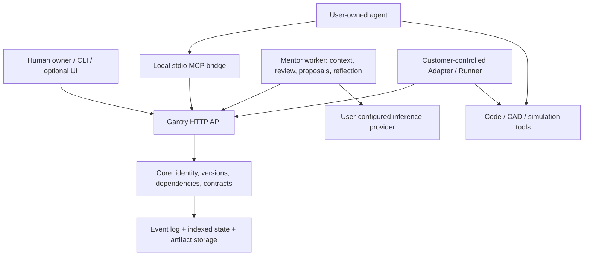

# Architecture

The API dispatches authenticated commands to Core. Mentor accesses the same records and submits its own evidence-linked outputs through that interface; those outputs are persisted in the ledger. The API is a boundary, not a separate source of truth. A configured worker runs analysis; a plain server does not silently start paid inference.

Core owns immutable snapshots, development states, changes, version-bound evaluations, work contracts, execution claims, review records and human adoption. Event append and state updates share transactional checks. Indexed read paths and content-addressed file retrieval avoid replaying an entire ledger for each restored file.

Mentor selects recorded context, requests specialist/coordinator analysis and stores findings, candidate work and engineering-check proposals. A proposed check is not a passed check. An external LLM is replaceable; the stored inputs, outputs and rationale remain Gantry records. A user-owned agent performs edits with the tools available in its environment.

A review is triggered by a submission: it groups a pinned state, changes and evidence. A follow-up can become a work contract, then an authorized execution and a new checkpoint. Sharing, integration, execution completion, review acceptance and formal adoption are distinct events.

Parallel changes start from fixed states. Integration checks overlapping edits and declared dependencies. Unknown physical compatibility remains unknown. Runtime checkpointing is opt-in and requires explicit subsystem serializers and matching model/evaluator/environment bindings; it does not resume arbitrary application process memory.

## Models and discovery

- Stable IDs locate projects, assemblies, components and work.
- Artifact revisions refer to immutable file content and acquisition metadata.
- Development states bind artifact combinations to requirements, constraints, decisions, open questions and environment.
- Changes bind purpose, base state, scope, assignee and checkpoints.
- Evaluations bind the exact tested inputs and scope. New inputs do not inherit a pass.
- Review/engineering proposals store cited evidence and inferred roles/checks separately from verified facts.

Inspect `docs/api-contracts.json` for the current command schemas. The source contracts define authoritative field names. Adapters must preserve original data and expose derived views with provenance and missing-data markers.
