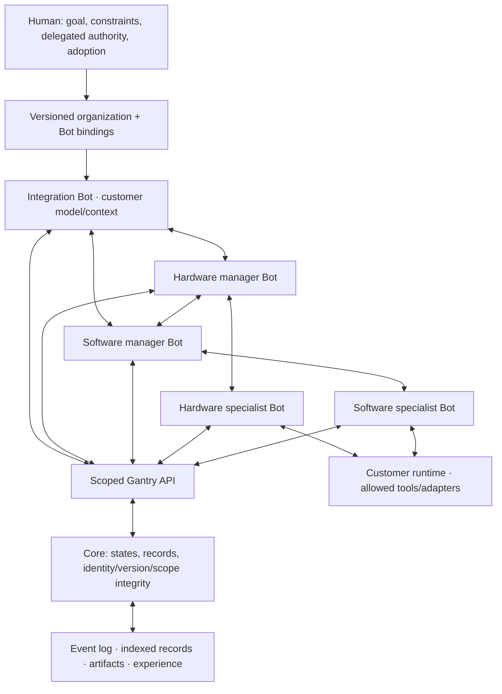

# Bot-owned autonomous development

## Objective and approved boundaries

Crew is the entire service in which a persistent organization of customer-owned
Bots develops across hardware/software. Integration and department managers reason,
compare alternatives, authorize work within human delegation and consult peers.
Core stores state, conversations and decisions and checks mechanical integrity.
Transport/worker code executes Bot requests; it never selects engineering winners.
Mentor is not on this path. Human formal adoption remains separate.

## Capability map and build order

| Module | Contract | Depends on |
| --- | --- | --- |
| bot-coordination | Directed requests, decisions, branch identity, experience | existing Bot tasks/identity/state |
| bot-action-loop | Read, edit, inspect, invoke tools, consult, reconsider | bot-coordination |
| organization-onboarding | Proposed hierarchy and atomic owner activation | bot-coordination |
| organization-acceptance | Multiple real reasoning contexts and tool results | all above |

## Runtime

One customer worker owns each Bot runtime fence. Its task-specific workspaces and
contexts isolate alternatives; different Bots run concurrently. Multiple tasks for
the same Bot are queued, not simultaneous owners of its identity. Optional action
loops use the customer's existing Codex subscription or configured inference bridge.
The model emits structured actions, the worker performs only allowed operations,
saves receipts/checkpoints, then presents actual results to the next model turn.
No unrestricted shell or implicit API-key fallback is introduced. Named local tools
are declared in the owner-approved environment and executed in the existing OS
sandbox on a disposable copy; authorized outputs alone return to the task workspace.
Missing tools remain explicit blockers. Intermediate failures remain recorded.

Managers delegate through existing task reports. Directed questions create read-only
response tasks without granting management or editing authority. Replies wake waiting
requesters; unanswered blockers prevent completion. Context changes during inference
invalidate the answer before effects. Decisions identify author, input state, evidence,
alternatives, targets and rationale. They cannot increase delegated access or adopt a
design. Candidate tags group independent task states, never merge them implicitly.
Lessons are provisional, attributed and scoped; reuse records references and outcomes.

## Preservation and implementation

Existing worker behavior remains available. Action loops are opt-in in the versioned
environment manifest. New projections/contracts are additive; existing events,
artifacts, Bot IDs and Mentor jobs are not rewritten or repermissioned.
Use existing Python modules, stdlib and unittest; no new runtime dependency.
Commands: `python -m unittest discover -s tests -v`; focused tests use
`PYTHONPATH=tests python -m unittest test_crew_coordination test_crew_runtime -v`.
Package verification: `python -m pip wheel --no-deps --no-build-isolation .`.
Use the repository's compact Python style, validate API input with contracts,
reuse Service transaction helpers and scoped artifact storage.

## Acceptance

1. A manager delegates to a department manager, which delegates to a specialist.
2. Directed peer consultation returns to the requesting Bot, including offline wait.
3. Independent candidates retain exact inputs and evidence; a Bot records selection.
4. A Bot reads omitted context, edits, runs an actual sandboxed check, sees failure,
   and revises; intermediate actions and receipts survive restart without blind replay.
5. Unauthorized delegation, stale inference, out-of-scope edits, unsafe paths,
   duplicate effects and uncertain tool restart are rejected or held explicitly.
6. Proposed organization activation is atomic, owner-only and does not create credentials.
7. A real subscription smoke exercise uses separate role contexts and no parent-written
   candidate choice. Report provider failures honestly; synthetic tests are not this proof.
8. Existing regression tests, replay and package checks pass; no formal adoption occurs.

No automatic purchase, manufacturing, physical motion, public deployment or inference
paid by the publisher. Engineering correctness and speed gains require separate studies.

## Responsibility and execution paths



The worker is a mechanical executor of the selected Bot's actions. No separate
Crew dispatcher chooses what to build. An engineering authorization is a Bot's
recorded decision and scoped assignment; Core still prevents impersonation,
stale writes and privilege escalation. Neither memory nor manager rank grants
an OS capability. Mentor does not review or authorize this development route.

| Event | Path |
| --- | --- |
| Start | Human goal/delegation → lead task → lead reasoning → child assignments |
| Delegate | Manager report → saved child tasks → each Bot's worker/context → reports → parent resumes |
| Consult | `ask_bot` → read-only peer response task → answer → requester resumes and resolves its question |
| Revise | Named tool observation/failure → next model action → edit/checkpoint → another actual check |
| Compare | Separate candidate states → exact-state checks → attributed `record_bot_decision` with alternatives |
| Stop | Source task fence + target task version → `stop_bot_task`; child cancellation is explicit |
| Recover | Confirm old process stopped → reconcile saved request keys/receipts → reuse exact provider input |
| Learn | Reports or `record_bot_experience` → scoped provisional memory → subsequent Bot input |

## Enable an action-loop worker

Extend a customer runtime configuration with `"workflow": "bot_development"`
and `"agent_loop": true`. Supply `local_tools` as a map of names to exact
`{"argv": ["/absolute/program", "arguments"], "timeout_seconds": 60}`.
`tool_runtime` must match `gantry.project_sandbox.runtime_roots()` in that worker's
Python environment, and `sandbox` must match `gantry.project_sandbox.backend()`.
Generate/approve the manifest with the same configuration:

```sh
gantry-crew bot-worker --config /private/bot.json --journal /private/journals --manifest
# Owner: configure_bot_runtime with that exact environment and scoped principal.
gantry-crew bot-worker --config /private/bot.json --journal /private/journals
```

The model receives authoritative action/assignment schemas, not just prose. It can
read/edit scoped files, retrieve context or peer task details, page saved records,
run a named sandboxed tool, ask/resolve a question, record a decision/experience,
propose a team, stop subordinate work and return a report with assignments.
Action records preserve the exact arguments/results, responsible identity,
provider usage, current checkpoint and workspace fingerprints. Tool output is
saved in the project's artifact zone. Unchanged completion does not duplicate an
already-saved intermediate checkpoint.

Recent action summaries are bounded in prompts. `get_bot_records` pages lossless
action/decision records; `context` and `inspect` address omitted details. Large
observations carry truncation markers. Fixed provider input limits still apply to
large projects; bounded summaries are not proof that all relevant context was read.

`propose_bot_team` records an inferred roster/hierarchy/profile. It neither starts
processes nor creates credentials. The owner uses `activate_bot_team` to apply a
version-checked proposal atomically to already-delegated principals. Omitted old
Bots/bindings are retained; explicitly disable them when replacing a roster.
Runtime environments remain separately owner-approved. Proposals never expand a
principal's existing rights.

## Preservation and operational limits

- Existing ledgers upgrade through additive indexed record collections. No history,
  source artifact, old Bot identity, permission list or Mentor job is rewritten.
  Back up first; older binaries cannot consume new events in-place.
- Existing principals need explicit new command delegation. Existing worker configs
  keep their prior behavior until action loops and their environment are approved.
- A lost Core acknowledgement is reconciled with the same request before a retry.
  A known old-fence rejection may rebind to the recovered claim only when its
  discussion is unchanged. Unknown local tool/edit effects remain held for inspection.
- Runtime/process stops, computer sleep or provider timeout do not become successful
  work. Preserve private journals, stop old processes and use explicit recovery.
  An uncertain provider invocation without a completed receipt requires inspection
  and a new assignment; it is not rerun automatically.
- Hierarchy and candidate isolation do not imply optimum organization, calibrated
  design-success probabilities or trained model weights. Lessons are provisional
  evidence, not new policy or privileges.
- One worker owns each Bot; its tasks are serial. Separate Bots run concurrently.
  More concurrent alternatives need separately scoped execution Bots. No unlimited
  CPU allocation or simultaneous ownership of one Bot is implied.
- Built-in tools are headless commands in the existing macOS/Linux sandbox; no native
  CAD GUI, arbitrary VM provisioning or hardware actuation was added. Existing
  tool/file size and sandbox constraints remain. Use an explicitly installed
  customer adapter for native toolchains and validate its capture coverage.
- API rejection at final integration remains an explicit held task; the runtime does
  not silently rebase a failed integration or discard an objection. A manager must
  revise/reassign against the current state.

## Reproduce the subscription acceptance

```sh
python -m pip install .
codex login status
python examples/crew_reasoning_loop.py --live-codex --output /new/private/crew-check
```

This explicitly uses the customer's existing ChatGPT login. It creates a fresh
anonymous ledger, five Bot identities and separate reasoning contexts, not customer
project mutations. The fixture preserves its evaluator and delegates edit scopes.
Its observation window (`--seconds`) limits the example only, not product usage.
On a Mac used for this test, keeping the host awake avoids lease expiration from
idle sleep. The output contains credentials and model journals: do not publish it.
See [acceptance evidence](CREW_ORGANIZATION_ACCEPTANCE.md) for successes, failed
attempts, inference usage and remaining unverified behavior.
