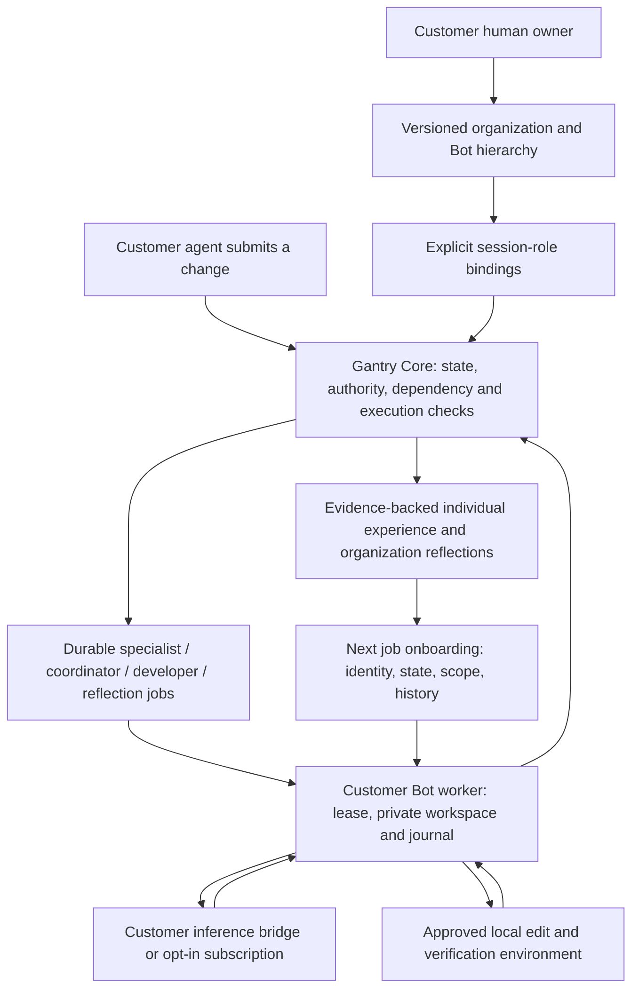

# Persistent organizations and Bots

Gantry stores a Bot identity independently of a chat, model process or development
session. The owner binds that identity to existing delegated session roles. A
customer-owned worker receives queued assignments, restores exact source state,
uses the Bot's onboarding and experience, returns results and records new experience.
The organization, each Bot and its runtime are versioned independently.

This extends the existing team and review/job machinery; it is not a new planner,
model host, Git server or CAD application. The same customer credential can be used
from different supported agent clients without losing the Bot's identity.

## Responsibilities and architecture



A parent Bot in the organization expresses stable reporting structure. The session's
approved review hierarchy controls execution order and authority. Binding an
organization Bot does not automatically replace that session hierarchy or add a
specialist. Keep them aligned when configuring the session; Core still waits for
all its required child reports. Organization/profile changes invalidate in-flight
job output rather than accepting an answer under changed onboarding.

## Owner setup

Use one shared Gantry ledger for the organization and its development sessions.
Run it on the customer's machine with `gantry serve`, or use a customer-hosted
Gantry endpoint over HTTPS. Independent `.gantry` stores created by local `connect`
are not silently merged, synchronized or automatically migrated into this ledger.
Back them up before any deliberate migration.

These are normal `gantry --url ... --token-file OWNER_TOKEN call OPERATION --input
FILE --key STABLE_REQUEST_ID` operations. The JSON contracts are in
[api-contracts.json](api-contracts.json). Never use the owner credential in inference.

1. Register the delegated principals and session team using [TEAMS.md](TEAMS.md).
   Use the general developer/reviewer MCP profiles (or a tighter explicit command
   allowlist), not an old local connection token whose facade lacks these commands.
2. `configure_organization`:

   ```json
   {
     "organization_id": "robot-studio", "version": 0, "name": "Robot studio",
     "profile": {"mission": "Preserve whole-system acceptance", "responsibilities": [],
       "focus_paths": [], "workflow": [], "report_when": ["Before integration"],
       "style": "Cite measurements and unknowns", "onboarding": []},
     "enabled": true, "share_reflections": true
   }
   ```

   `share_reflections` is opt-in. It automatically shares provisional outcome
   reflections with authorized Bots in this organization. Other personal memories
   remain private to the Bot unless the owner calls `share_organization_memory`.
3. `configure_bot` for each integration, departmental or specialist Bot:

   ```json
   {
     "bot_id": "integration-lead", "organization_id": "robot-studio", "version": 0,
     "name": "Integration lead", "parent_bot_id": null, "enabled": true,
     "profile": {"mission": "Reconcile subsystem reports with system acceptance",
       "responsibilities": ["Identify missing integration evidence"], "focus_paths": [],
       "workflow": ["Read child reports before judging the candidate"],
       "report_when": ["After specialist reports"], "style": "Separate facts and assumptions",
       "onboarding": ["Technical OK is not formal adoption"]}
   }
   ```

   Create parents first; child `parent_bot_id` references them. Cycles and
   cross-organization parents are rejected. Version 0 creates; use the returned
   version for the next update. Agents cannot activate identity/authority changes.
4. `bind_bot` with `bot_id`, `session_id`, existing `role`, `version: 0`, `enabled:
   true`. Session and organization must have the same human owner. This grants no
   access by itself: the role's principal must already have session and zone access.
   Bind the same Bot to its role in later sessions to retain experience. Existing
   roles are not retroactively relabeled, and a role cannot silently switch Bot IDs.
5. Enable existing `configure_review_automation` for each session. Its explicit
   execution policy still applies. Bot setup does not change test/acceptance rules,
   provider quotas, iteration delegation or human adoption requirements.

## Runtime setup and automatic work

Each runtime uses an existing delegated principal. Configure its token file with
owner-only permissions (`chmod 600`). A Bot's active bindings must use this same
principal; rotating that principal's credential does not change the Bot identity.

Example local `bot.json` for a customer-installed inference bridge:

```json
{
  "url": "http://127.0.0.1:8765",
  "token_file": "/absolute/private/reviewer.token",
  "bot_id": "integration-lead",
  "name": "Integration lead workstation",
  "backend": "external_agent",
  "command": ["/absolute/bin/customer-inference-bridge"],
  "executable_hash": "SHA256_OF_THE_REGULAR_EXECUTABLE",
  "environment_definition": "Customer-pinned toolchain definition or image digest",
  "tools": ["source review"]
}
```

The bridge reads one JSON object with `context` and `schema` from stdin and prints
one JSON answer conforming to that schema. It is a trusted installed customer
program, not a shell command supplied by the model. Its executable hash is checked.
No host environment credentials are inherited. The bridge handles its own login
and provider, including Claude or another installed customer agent. Arbitrary
Claude/Cursor desktop windows are not launched or controlled automatically.

Alternatively explicitly choose `"backend": "codex_subscription"` and omit
`command`/`executable_hash` to use the existing official Codex ChatGPT-login bridge.
No API-key fallback is used. There is no default provider or publisher-paid account.
Model weights and competence are not modified by this feature.

Optional `verification` is an already delegated recipe; optional `cad_python` uses
the existing CAD inspector. `environment_definition` should identify pinned tool
versions/dependencies. It is a declaration, not automatic provisioning or proof
that all installed libraries match. Runtime `tools` is descriptive, not a grant.

```sh
# Print public environment metadata, without the token or local token path.
gantry bot-worker --config bot.json --journal /private/gantry-bots --manifest
```

Pass that output as `environment` in an owner call to `configure_bot_runtime`:
`{"bot_id":"integration-lead","version":0,"principal_id":"REVIEWER_ID",
"enabled":true,"environment":{...}}`. The worker verifies this exact approved
manifest before it starts. Changed provider/verifier configuration needs a new
runtime version. It does not create new execution permission.

```sh
# One pass, then continuous operation without a chat prompt.
gantry bot-worker --config bot.json --journal /private/gantry-bots --iterations 1
gantry bot-worker --config bot.json --journal /private/gantry-bots
```

Run one worker per Bot; independent Bots can run concurrently. Pending submissions
wake the appropriate specialist/coordinator. Reports release parents, requested
corrections queue the developer, and returned changes queue re-review and reflection.
Individual logs do not start model calls. When no work is available, only the queue
and heartbeat are checked. Pending work survives worker downtime. Starting the
worker later discovers it automatically, without copying a previous conversation.

The worker stores `HASH(bot_id)/runtime.json`, `last-tick.json`, and
`jobs/HASH(job_id)/{job.json,workspace,model,...}` beneath the selected private
journal root. This is a durable per-Bot environment with isolated job directories,
not a new VM or security sandbox. A trusted local bridge/verifier can exercise the
host user's OS rights; deploy in a container/VM when process isolation is required.
The token file stays outside restored workspaces and inference inputs. Do not
upload private journals as telemetry.

## Start at login / after reboot

Generate an opt-in service for the installed Gantry executable:

```sh
gantry bot-service --platform launchd --config /private/bot.json \
  --journal /private/gantry-bots --executable /absolute/bin/gantry \
  --output gantry-bot.plist
# Or --platform systemd --output gantry-bot.service
```

Review and install the generated user service using the OS's standard mechanism:
`launchctl bootstrap gui/$(id -u) /absolute/gantry-bot.plist` on macOS, or place the
unit in `~/.config/systemd/user/` and use `systemctl --user enable --now
 gantry-bot.service` on Linux. A user service's availability after logout depends
on host policy. Generating the file does not install it or start a model. Keep the
Gantry server available too. The service supervisor restarts a worker after process
or connection failure; a replaced/expired runtime cannot finish old work blindly.

## Stop, recover and inspect

`get_persistent_bot` returns identity, authorized bindings, environment declaration
and online/offline status. `bot_inbox` pages assignments. `get_bot_context` includes
persistent individual experience and owner-shared organization lessons in addition
to pinned state and current session context. MCP developer/reviewer profiles expose
these reads and the fenced runtime/job operations; they do not expose owner setup.

A runtime holds a renewable 60-second fence; another live runtime cannot claim it.
This lease is a liveness check, not an eight-hour lifetime limit. A local lock also
prevents two processes using the same journal. Stale profiles, changed bindings,
disabled organizations, expired leases and revoked credentials prevent old output
from being applied/returned. Already-running third-party model calls are not
magically canceled; the worker rejects their stale results before applying edits.

Stop the user service before manual recovery. Investigate any saved provider or
verification process and confirm it has stopped. Failed/interrupted jobs stay held;
they are not automatically repeated just because the worker reconnects.

```sh
gantry bot-worker --config bot.json --journal /private/gantry-bots \
  --recover-job JOB_ID --confirm-stopped "Previous worker and child processes stopped"
```

This starts the authorized runtime, uses the existing fenced recovery path, then
finishes that one job. Completed model receipts are reused. Only add
`--retry-inference` for an explicitly approved new attempt when no completed result
exists; use `--collect-interrupted-verification` to preserve incomplete verification
as unknown. Changed onboarding or acceptance requires resubmission, not stale reuse.
The old Bot journal is required; Core stores design state but does not reconstruct
an arbitrary process's RAM, an unsaved CAD operation or missing local credentials.

## Learning, scope and migration

Every bound specialist/coordinator/developer completion records reported experience;
the outcome reflection adds an assessed provisional lesson. Each memory includes
Bot/binding version, source session/state, evidence, paths and recorded hashes.
Cross-session contradictions/supersession preserve the old evidence. Next-job
onboarding uses a bounded recent preview and paginated retrieval for older records.
Memories are evidence to reconsider, never executable instructions or new authority.

Organization sharing keeps source-session authorization checks. Removing access or
disabling its binding removes that evidence from future retrieval; it cannot erase
copies already legitimately delivered to an external model or local journal. No
cross-customer sharing, private-project extraction or model training is performed.
Human formal adoption remains separate from execution/review completion.

Storage is additive: `organizations`, `persistent_bots`, `bot_bindings`,
`bot_runtimes`, `organization_memories`, optional Bot metadata on existing memories
and jobs, and disposable SQL indexes. Old events and artifact bytes remain intact.
Existing unbound sessions and workers continue to work. Back up before upgrade;
older binaries do not understand new event tables. Separate ledger federation and
automatic migration of historical session-only memories are not implemented.

Acceptance evidence is in `tests/test_persistent_bots.py` and `tasks/validation.md`.
Fixture inference is labeled; Core, queues, edits, persistence, replay and recovery
are real. Tests establish mechanics, not robotic design quality, measured speedup
or parity with every capability of a commercial persistent-agent product.
