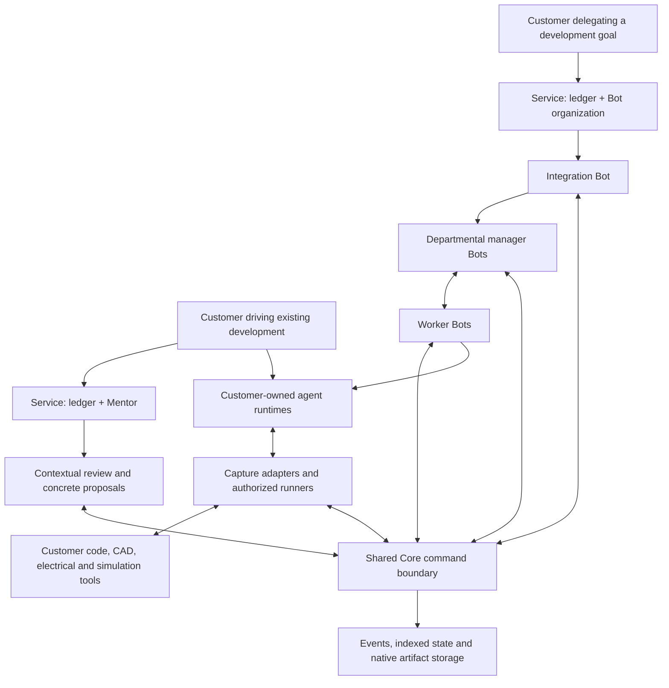

# Two independent services, one ledger foundation

Decision recorded: 2026-10-03. Gantry Ledger (`gantry-ledger`) and Gantry Crew
(`gantry-crew`) are independent entry points delivered in the shared Python
package. The previous `gantry-review` and `gantry-bots` entry points remain
compatibility aliases. Existing v3.0.0 review-driven Bot jobs keep their legacy
handler. These product names do not rename historical events or APIs.

See [Bot development setup and recovery](BOT_DEVELOPMENT.md) for the implemented
path and its limits.

## Customer choice

| | Gantry Ledger | Gantry Crew |
|---|---|---|
| Customer intent | Keep driving development with existing people and agents; get contextual review and concrete change suggestions | Delegate development to a persistent team that plans, assigns, integrates and revises work |
| Starting point | A submitted change or investigation request with its state and evidence | A development goal, acceptance conditions, baseline and delegated authority |
| Who decides the next work | The customer and their existing development agents, using Mentor's advice | The responsible worker, departmental manager or integration Bot within delegated authority |
| Main result | Findings, technical assessment, evidence and proposed code/CAD changes or follow-up work | Evolving development states, candidate designs, decisions, evaluations and handoffs |
| Required setup | Project, capture/tool connections and review scope | Project, tools, versioned organization, Bot roles, authority and customer runtimes |
| Not required | An autonomous Bot organization | Mentor, a Mentor subscription or a Mentor approval step |

These are separate customer-facing services, not two modes that require a customer
to configure the whole product. Each needs its own onboarding, entry points,
configuration and operational documentation. Using either service alone must be
supported. Sharing implementation libraries does not require separate databases,
microservices or repositories, nor does it justify coupling their workflows.

## Responsibility boundaries

**Gantry Ledger.** Store ongoing development state and submitted milestones.
Mentor retrieves relevant constraints, previous failures, dependencies and evidence;
returns a technical assessment and concrete alternatives, patches or work proposals;
and records the outcome when the customer responds. It can request further evidence.
Technical acceptance is not human formal adoption. A review proposal is not an
execution authorization. Optional delivery to an already delegated customer agent
must not require an organization hierarchy or turn Mentor into that agent's manager.

**Gantry Crew.** A persistent organization runs development through
integration leaders, departmental managers and specialists. Workers decide and
iterate within their scope. Managers reconcile reports, select the next problems,
compare candidates and coordinate across departments; the integration leader owns
whole-system progress. Peer questions, objections and dependency negotiations are
first-class records. A hierarchy does not require every edit to traverse every
manager: versioned scope and reporting milestones determine when escalation is
needed. Review and technical judgment here are Bot responsibilities. They do not
route through Mentor as a mandatory decision-maker.

The organization owns planning policy; Core enforces the resulting contracts.
Engineering constraints and acceptance evidence bound candidate feasibility.
Recorded continuation, stopping and escalation rules prevent endless local changes.
Organization changes and lessons are versioned and evaluated against outcomes;
stored experience is provisional evidence, not automatic proof or added authority.
Individual Bots retain the corrections and results of their own work. Authorized
team lessons and manager decisions remain available for future onboarding.

**Shared Core.** Reuse the ledger, immutable development states, native artifacts,
restoration, capture metadata, dependencies, evidence, identities, permissions,
work contracts, execution checks and human adoption. Reuse queue/lease/recovery
primitives where suitable. Core does not choose the best engineering design.
Services call its authenticated command boundary, whether in-process or over HTTP;
review history, Bot decisions and outcomes are all stored through that boundary.

**Customer-owned execution.** The customer supplies the Claude, Codex, Cursor or
other supported agent runtime, model account and connected tools. A Bot is Gantry's
persistent identity, scope and experience supplied to that runtime; it is not a
publisher-funded model account. Tools may be installed locally or supplied through
customer APIs/MCP. Neither service implies free or unlimited provider usage.

## Target architecture

The diagram describes responsibility, not a required deployment topology. There is
no mandatory Mentor-to-Bot dependency. A common Core library may serve independent
ledgers. Access to the same ledger is optional and requires explicit project grants.

## Independent workflows

**Gantry Ledger:** save or retrieve state → edit using customer tools → submit a
meaningful change/request → Mentor retrieves evidence and reviews → customer or
their agent responds/edits → save the result and review outcome. Recording a log
does not require an inference call. Unfinished and unverified work remain saveable.

**Gantry Crew:** retrieve goal/state/experience → integration and departmental Bots
prioritize and assign work → workers develop independent candidates → return
checkpoints and evidence → managers resolve cross-domain issues and decide whether
to continue, stop or test further → integrate and update the plan. A failed run or
changed dependency can wake the responsible Bot under an explicit event policy.
Offline work stays queued; uncertain interrupted effects are reconciled before
retry. None of these steps requires a Mentor job or Mentor review approval.

Both workflows keep completion, sharing, verification and adoption separate.
Human formal adoption remains required. The service split adds no authority to
purchase, manufacture, deploy or operate hardware.

## Optional use together

- A customer can share an authorized project/state between the services or hand
  off an explicit work contract. No automatic project or memory sharing.
- Every assignment identifies its responsible principal, originating workflow,
  baseline, scope, decision owner and evidence. Concurrent independent candidates
  use separate changes/workspaces; overlapping integration remains checked.
- A Bot team may explicitly request an additional Mentor review. That result is
  advice and evidence to the responsible Bot, not an override or mandatory gate.
- Switching responsibility requires an acknowledged handoff. Enabling both
  services must not silently create two dispatchers for the same assignment.
- Customer permissions still control retrieval, model disclosure and tool execution.
  A parent role, remembered preference or shared project does not expand authority.

## Current implementation and migration

The v3.0.0 foundation is reused with additive changes in this source revision:

| Previous implementation | Current source implementation |
|---|---|
| One `gantry-ledger` package and `gantry` entry point | `gantry-ledger` and `gantry-crew` entry points and separate MCP profiles; shared package retained |
| Mentor submission/review and customer correction path | Retained without requiring Bot setup |
| Persistent organizations, Bot identities, experience, runtimes and inbox | Reused with independent development bindings |
| `BotWorker` calls `mentor_daemon.process_job`; Bot inbox reads `mentor_jobs` | New assignments use `bot_tasks` and `bot_execution`; only legacy jobs call the old handler |
| Bot role bindings depend on the session review team | Independent principal, scope, assignment and integration grants; no review team required |
| States, evidence, contracts and artifact storage | Existing Core primitives retained with explicit workflow provenance and project access |

Do not rename historical Mentor jobs into Bot planning records or reinterpret old
permissions. Preserve event IDs, artifact hashes, organization/Bot identities,
memories and existing connections. New assignments need explicit workflow routing;
legacy jobs keep their old handlers until completed or reconciled. A migration
must preserve provenance, be retryable and verified through export/restore/replay.
It must not activate workers, enable a model, or broaden delegation automatically.
Workflow selection applies to recovery as well as queue dispatch. Independent Bot
workers refuse legacy Mentor recovery, and explicitly legacy workers refuse Bot
task recovery. The generic entry point retains backward compatibility. Service
setup rejects contradictory runtime configuration instead of silently changing it.

## Acceptance and remaining validation

The regression suite and `tests/test_bot_development.py` cover independent queues,
hierarchical reporting, real file edits, candidate integration, authorization,
interruption recovery and replay. `examples/bot_development_loop.py` exercises the
default worker through real customer-bridge subprocesses using labeled synthetic
reasoning. The following describes the acceptance boundary, not a claim that an
arbitrary customer toolchain or model has been validated.

1. A customer connects, checkpoints, receives a review, applies a proposed change
   and records its outcome with no Bot organization or Bot worker configured.
2. With Mentor workers disabled and no Mentor review configured, a Bot organization
   starts from a goal, assigns work, exchanges reports, resolves a cross-department
   dependency, integrates a candidate and retrieves its experience on the next task.
3. Workers, departmental managers and the integration leader can each explain their
   authority, current baseline, unresolved conditions and reason for the next task.
4. Either workflow resumes after interruption; disabling one service does not
   disable the other's work or silently reassign its pending jobs.
5. Optional handoff uses a separate session initialized with explicit source-state
   evidence, restored bytes and context. Automatic transfer of an in-flight job
   between services remains unsupported; stop/reconcile the old work first.
6. Historical ledgers restore and replay unchanged; sharing, review acceptance,
   integration and execution still do not imply formal adoption.

Test mechanics with labeled synthetic inference separately from customer model and
tool integration. Independent operation does not, by itself, establish development
speed gains or customer demand for either product.
