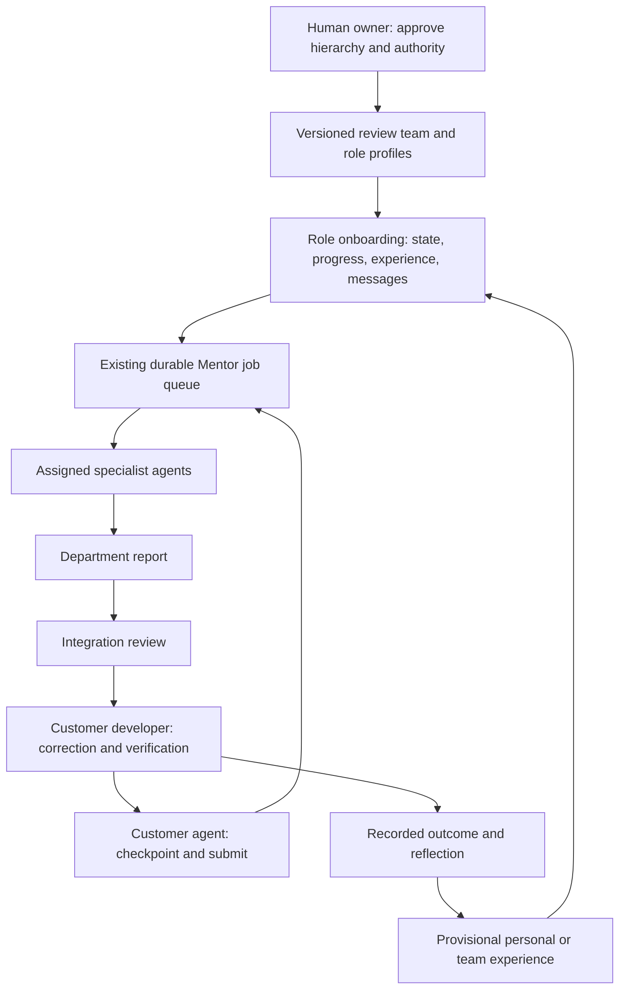

# Teams and personal Bots

A Bot can have a permanent organization-level identity bound explicitly to roles
in multiple development sessions. Older unbound roles retain session-scoped identity.
See [Persistent Bots](PERSISTENT_BOTS.md) for setup, customer runtimes and automatic wake-up. Gantry stores its mission, responsibilities, working style, onboarding,
reporting milestones, current state and evidence-backed experience. Your Claude,
Codex, Cursor or other client supplies the actual agent/model. Changing the worker
conversation does not erase the role's saved context.

The `user` / `gantry` member sides distinguish developer and reviewer authority;
they do not require Gantry-funded inference or one model provider per role.
Profiles and memory never grant additional authority. Principal permissions,
allowed commands, session/change scopes, expiry and execution checks still apply.

## Local project setup

Connect a work-capable project using the README. Existing connections need the
new package and a client MCP reload. Read the current team version:

```sh
gantry project bot --root /path/to/project
```

Older connections may reject the new team tools because their original command
allowlist is retained. Inspect the connection's session and team as its owner with
the existing `get_review_team` API; then run the owner setup below. This explicitly
adds only the scoped team facade to that connection, without extending its expiry,
file access, test commands or model delegation. Removing the old review count cap
alone does not require this setup.

Save an owner-reviewed `team.json` with the current `team_version` as `version`:

```json
{
  "version": 1,
  "profiles": {
    "developer": {
      "mission": "Maintain the controller's boundary behavior",
      "responsibilities": ["Preserve interface compatibility"],
      "focus_paths": ["src/"],
      "workflow": ["Read the saved state and unresolved questions before editing"],
      "report_when": ["Before integration", "When an assumption changes"],
      "style": "Concise; separate measurements from assumptions",
      "onboarding": ["Keep acceptance tests unchanged"]
    }
  }
}
```

```sh
# Explicit owner operation, deliberately not exposed as an agent MCP tool.
gantry project team --root /path/to/project --input team.json --request-id team-setup-1
gantry project bot --root /path/to/project
gantry project memories --root /path/to/project
gantry project messages --root /path/to/project
```

`profiles` updates the named roles without changing the existing hierarchy or
principal bindings. Configure `mentor` too to personalize review. `focus_paths`,
`workflow` and `report_when` guide the model; they are not new path permissions or
automatically inferred physical completion criteria. The team version changes,
so pending reviews must be resubmitted; advanced automation must be reauthorized.

Agents use `project_bot`, `project_remember`, `project_memories`, `project_message`,
`project_messages` and `project_resolve` through MCP. The corresponding CLI actions
take JSON with `--input` and stable request IDs for writes. For example, after
checkpointing, submit a lesson using the exact state ID returned by `project_bot`:

```json
{
  "visibility": "team",
  "observation": "The consumer depends on the controller's lower-bound clamp",
  "applicability": "Before changing the public clamp function",
  "limitations": ["Check callers and requirements again if their versions change"],
  "evidence": ["STATE_ID_FROM_GANTRY"],
  "paths": ["src/control.py"],
  "assessment": "inconclusive"
}
```

```sh
gantry project remember --root /path/to/project --input lesson.json --request-id lesson-1
```

These are reported observations with provenance. They are not independently proven
rules. Core verifies referenced objects and paths exist in the session; the agent
must judge whether their contents support the claim. The next Mentor prepare and
worker job include applicable role/team memory. Changed recorded file hashes are
explicitly marked for rechecking. Identical hashes do not prove applicability of
all physical or unstated dependencies.

## Hierarchical team workflow

Use the existing HTTP API or scoped MCP for a multi-principal deployment:

1. The owner registers principals and session participation. Agents cannot create
   their own privileges through a team profile.
2. An agent can `propose_review_team` with a full `configuration` matching
   `configure_review_team`, a reason and saved evidence IDs. It stays proposed.
3. The human owner reviews it and calls `activate_team_proposal`. This versions the
   existing team. Ordinary `configure_review_team` is also still available.
4. Set a Gantry-side coordinator and parent roles, for example
   `integration -> engineering -> mechanical`. Each member can have a `profile`.
5. Enable the existing `configure_review_automation` under owner delegation.
   A submitted change creates durable specialist and coordinator jobs. Required
   specialist ancestors are included automatically; parents wait for child reports.
6. A customer's assigned agent claims `claim_mentor_job`, receives the exact
   state plus `context.bot_context`, and returns through `finish_mentor_job`.
   Alternatively the existing `mentor-worker` runs with the customer's explicitly
   configured subscription. Offline agents can claim pending jobs later.
7. A requested correction creates the existing developer job. Captured edits,
   resubmission and reflection use the established Core/worker path. Reflection
   automatically becomes provisional team experience for later job inputs.



The worker's input is pinned in its private journal. Resume uses the existing
fences/recovery protocol. Team, policy, dependencies or relevant reports changing
invalidate old work. Updating a child report invalidates ancestor summaries;
submit a new review when an already-completed parent job needs a new pass. No
individual log event starts a model call by itself.

## Questions, objections and handoffs

`send_team_message` records `question`, `answer`, `objection`, `dependency`,
`handoff` or `report` with sender/recipient roles, submission, state and evidence.
The authenticated principal must own the sender role. A message does not itself
reassign a job or authorize execution.

Questions, objections and dependencies may be blocking. Answers reference their
parent via `reply_to`; they do not silently clear the blocker. Only the original
author still bound to that role, or the human session owner, can resolve it with
evidence and a reason. Blockers persist across resubmissions of the same change.
They prevent technical OK and review-driven automated developer execution. They
do not prohibit all exploratory edits that might resolve the question.

Messages change the review context fingerprint. An old inference answer cannot
finish against newly changed discussion. Reread/resubmit instead of treating that
answer as a current review. Listing uses durable cursors; notices can be polled
through `events` by appropriately scoped general API principals.

## Experience and its limits

- `record_bot_memory` preserves role/team scope, evidence, input hashes,
  applicability, uncertainty, author and team version. `supersedes` and
  `contradicts` retain earlier evidence; contradictions are not silently resolved.
- Experience is supplied as evidence, never as authoritative instructions.
  Learning here means persistent retrieval and outcome reflection, not updating
  model weights, automatically granting authority or rewriting requirements.
- Recent onboarding is bounded to 30 memories; communication previews to 50.
  Truncation is explicit and the paginated APIs retain access to older records.
- Bound Bots retain identity and experience across authorized sessions in one ledger.
  Organization reflections can be shared automatically under owner policy. Source
  access is rechecked on every retrieval. Unbound local connections do not silently
  import another project's knowledge; separate local stores are not federated.
- The advanced automation policy currently delegates one developer principal per
  session. Specialist jobs and independent sessions can run concurrently. This is
  not a general autonomous company planner, automatic model launcher for every
  client, or a measured improvement in development speed.
- Existing configured advanced worker execution/round limits remain; local project
  review and test submissions have no Gantry count cap. New local connections have
  no automatic expiry. `project unlimit` removes legacy expiry while retaining the
  same connection/session; cross-session identity requires an explicit persistent Bot binding.
  Provider limits still apply.

## Storage and verification

The update is additive: optional profiles on `review_teams`, plus `team_proposals`,
`team_messages` and `bot_memories` projections. All mutations use authenticated,
idempotent Core transactions and the append-only event log. No historical
artifacts are overwritten. New projections replay deterministically. Older
binaries do not understand the new event tables; keep a backup before upgrading
and do not downgrade an updated ledger in place.

`tests/test_bots.py` exercises hierarchy ordering, real worker handoff and captured
edits, next-job reflection retrieval, blocker resolution, changed-input detection,
owner approval, local MCP onboarding and event replay with explicitly labeled
fixture inference. These tests do not claim real-world design correctness or
improved model quality.
